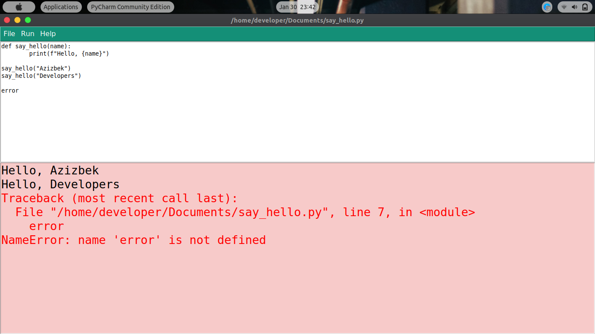
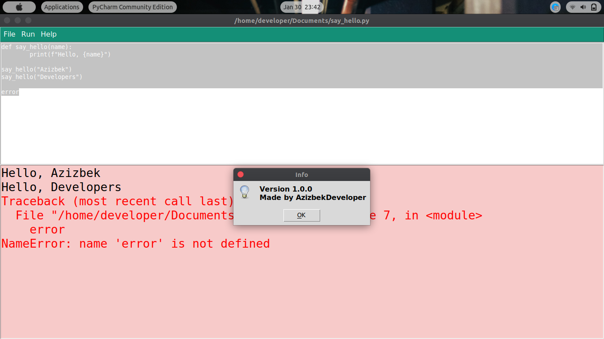
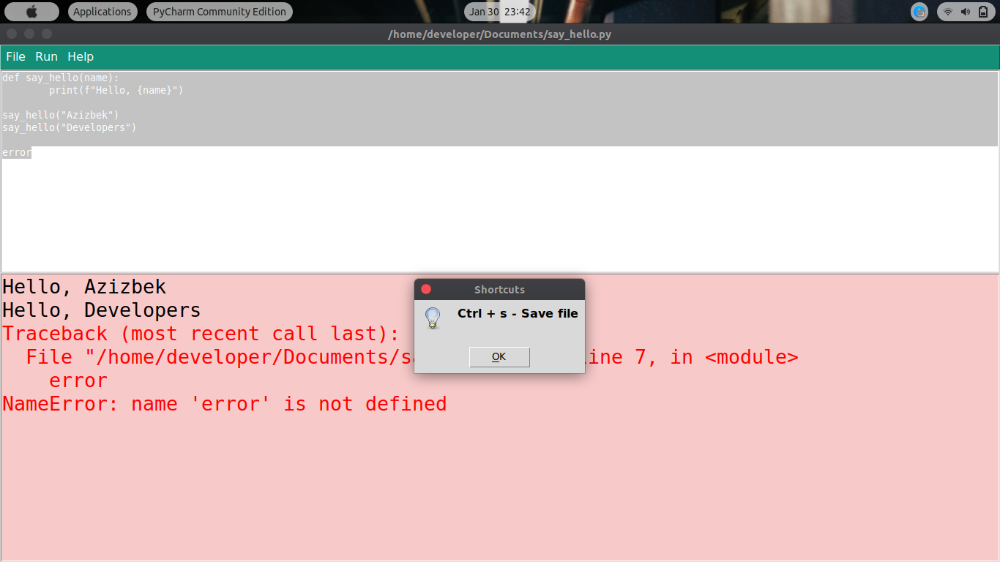

# python_IDE
A simple Python IDE made by AzizbekDeveloper. 
This project is OPEN SOURCE. You can clone this project and create your own IDE!

### if you are using Linux, You have to run that command!
```bash
sudo apt-get install python-tk
```

APP GUI






Clone this repo and whatch this video for some INFO
[VIDEO LINK](./help.mp4)